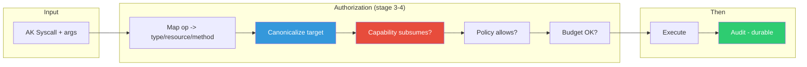

# Request Authorization Reference

This page describes how the Authority Kernel authorizes each syscall: the capability scope it requires and how targets are canonicalized before policy matching.

> **Legacy note.** Earlier drafts described an "effects" layer (`ak_effect_op_t`, `AK_E_*` opcodes, `ak_authorize_and_execute()`, `ak_effect_from_open()`), implemented in `ak_effects.c`. That file is **not compiled into the kernel** — it is excluded from the build and is legacy/dead code. The compiled enforcement path authorizes syscalls directly: `ak_syscall_handler()` → `ak_dispatch()` → per-op capability, policy, and budget checks. The `AK_E_*` opcodes below the fold are retained only as historical reference and do not describe runtime behavior.

## How a Syscall Is Authorized

During stage 3 of the dispatch pipeline, `ak_validate_capability()` maps the syscall's op and arguments to a required capability **type**, **resource**, and **method**, then requires a capability (explicit token, delegated grant, or root admin cap) whose scope subsumes that tuple. Deny-by-default: if nothing subsumes it, the request fails closed.



## Required Capability by Syscall

| Syscall | Capability type | Resource scope | Method |
|---------|-----------------|----------------|--------|
| `AK_SYS_READ` / `WRITE` / `DELETE` | `AK_CAP_HEAP` | heap pointer (decimal) | op name |
| `AK_SYS_ALLOC` | `AK_CAP_HEAP` | type hash | op name |
| `AK_SYS_BATCH` | `AK_CAP_HEAP` | `*` (per-op re-validated) | op name |
| `AK_SYS_CALL` | `AK_CAP_TOOL` | tool name | `invoke` |
| `AK_SYS_INFERENCE` / `INFER_ISSUE` | `AK_CAP_LLM` (= INFERENCE) | request target | `inference` |
| `AK_SYS_SPAWN` | `AK_CAP_SPAWN` | program (or `*`) | `spawn` |
| `AK_SYS_SEND` | `AK_CAP_IPC` | recipient | op name |
| `AK_SYS_RECV` | `AK_CAP_IPC` | `*` (own inbox) | op name |
| `AK_SYS_QUERY` | `AK_CAP_ANY` | `audit_log` | op name |
| `COMMIT` / `RESPOND` / `ASSERT` | `AK_CAP_ANY` | `*` | op name |

Capabilities that fail to extract a required field (e.g. a `CALL` with no `tool`, or an outbound request with no target) are rejected fail-closed with `E_CAP_SCOPE`.

## Capability Types

```c
typedef enum {
    AK_CAP_NET       = 1,    /* Network access */
    AK_CAP_FS        = 2,    /* Filesystem access */
    AK_CAP_TOOL      = 3,    /* Tool execution */
    AK_CAP_SECRETS   = 4,    /* Secret resolution */
    AK_CAP_SPAWN     = 5,    /* Child spawning */
    AK_CAP_HEAP      = 6,    /* Heap object access */
    AK_CAP_INFERENCE = 7,    /* Outbound request access */
    AK_CAP_LLM       = 7,    /* Alias for INFERENCE */
    AK_CAP_IPC       = 8,    /* Inter-process communication */
    AK_CAP_ANY       = 254,  /* Wildcard - matches any type */
    AK_CAP_ADMIN     = 255,  /* Administrative (root) */
} ak_cap_type_t;
```

## Target Canonicalization

For filesystem and network enforcement, targets are canonicalized before policy matching so that equivalent inputs compare equal.

```mermaid
flowchart TB
    subgraph "Filesystem Canonicalization"
        FS_IN["./foo/../bar/file.txt"]
        FS_CWD[CWD: /app]
        FS_ABS[Absolute: /app/./foo/../bar/file.txt]
        FS_CLEAN[Clean: /app/bar/file.txt]
        FS_OUT["/app/bar/file.txt"]

        FS_IN --> FS_CWD
        FS_CWD --> FS_ABS
        FS_ABS --> FS_CLEAN
        FS_CLEAN --> FS_OUT
    end

    subgraph "Network Canonicalization"
        NET_IN["::ffff:192.168.1.1:443"]
        NET_MAP[IPv4-mapped detection]
        NET_NORM[Normalize to IPv4]
        NET_OUT["ip:192.168.1.1:443"]

        NET_IN --> NET_MAP
        NET_MAP --> NET_NORM
        NET_NORM --> NET_OUT
    end

    subgraph "DNS Canonicalization"
        DNS_IN[example.com]
        DNS_FMT[Add prefix]
        DNS_OUT["dns:example.com"]

        DNS_IN --> DNS_FMT
        DNS_FMT --> DNS_OUT
    end

    style FS_OUT fill:#3498db,color:#fff
    style NET_OUT fill:#9b59b6,color:#fff
    style DNS_OUT fill:#2ecc71,color:#fff
```



### Filesystem Paths

1. Convert relative to absolute (using cwd)
2. Remove `.` segments
3. Resolve `..` segments lexically (symlinks not resolved)
4. No trailing slashes (except root)

**Example:** input `./foo/../bar/file.txt`, cwd `/app` → `/app/bar/file.txt`

### Network Addresses

1. IPv4-mapped IPv6 normalized to IPv4
2. Port always included
3. Format: `ip:<addr>:<port>` or `dns:<host>:<port>`

**Examples:**
- `::ffff:192.168.1.1:443` → `ip:192.168.1.1:443`
- `example.com:8080` → `dns:example.com:8080`

### DNS Targets

Format: `dns:<hostname>`. DNS resolution is authorized separately from connection: a `net.connect` with a `dns:` target requires prior DNS authorization.

## Policy Matching

Once a target is canonicalized, it is matched against the loaded policy's patterns. Pattern matching uses glob-style syntax:

- `*` matches any characters except `/`
- `**` matches any characters including `/`
- Exact strings require an exact match

```json
{
  "fs": {
    "read":  ["/etc/**"],
    "write": ["/tmp/**"]
  },
  "net": {
    "connect": ["ip:10.0.0.0/8:*"],
    "dns":     ["*.example.com"]
  }
}
```

A request is admitted only when a capability subsumes its type/resource/method **and** a policy rule matches its canonical target **and** the operation fits within the hard budget. Any failure is denied and logged.

---

## Appendix: Legacy Effect Opcodes (not compiled)

The following `AK_E_*` opcodes were defined in the uncompiled `ak_effects.c` layer. They are **not** part of the runtime enforcement path and are listed only for historical context.

| Effect | Code | Notes |
|--------|------|-------|
| `AK_E_FS_OPEN` | 0x0100 | Legacy — superseded by POSIX routing + heap/FS capabilities |
| `AK_E_FS_UNLINK` | 0x0101 | Legacy |
| `AK_E_NET_CONNECT` | 0x0200 | Legacy — network enforcement lives in `ak_net_enforce.c` |
| `AK_E_NET_DNS_RESOLVE` | 0x0201 | Legacy |
| `AK_E_TOOL_CALL` | 0x0400 | Legacy — replaced by `AK_SYS_CALL` handler |
| `AK_E_INFER` | 0x0402 | Legacy — replaced by `AK_SYS_INFERENCE` / `INFER_ISSUE` |
