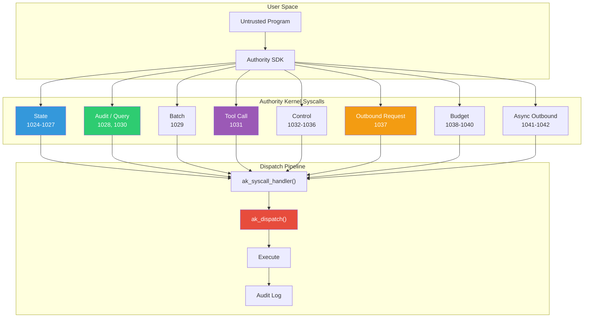
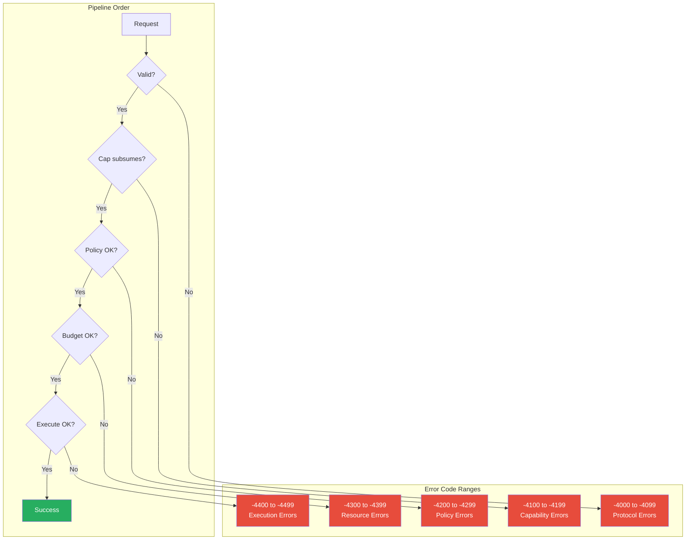
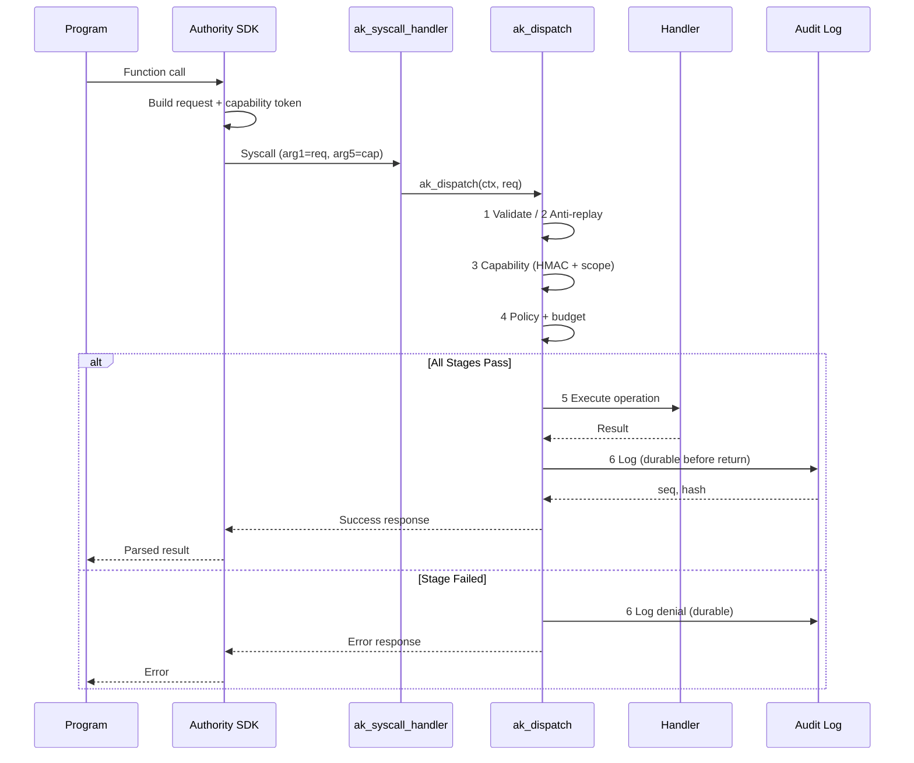

# API Overview

The Authority Kernel exposes a set of syscalls (numbers 1024+) to the single untrusted program running in the VM. Every call is routed through the dispatch pipeline before any effect executes.

## Syscall Architecture



## Syscall Categories

### State Management (1024–1027)

| Syscall | Number | Description |
|---------|--------|-------------|
| `AK_SYS_READ` | 1024 | Read heap object |
| `AK_SYS_ALLOC` | 1025 | Allocate new typed object |
| `AK_SYS_WRITE` | 1026 | Patch object (CAS) |
| `AK_SYS_DELETE` | 1027 | Soft-delete object |

### Audit and Query

| Syscall | Number | Description |
|---------|--------|-------------|
| `AK_SYS_QUERY` | 1028 | Query audit log |
| `AK_SYS_COMMIT` | 1030 | Force audit log commit |

### Batch

| Syscall | Number | Description |
|---------|--------|-------------|
| `AK_SYS_BATCH` | 1029 | Atomic batch of operations |

### Tools

| Syscall | Number | Description |
|---------|--------|-------------|
| `AK_SYS_CALL` | 1031 | Execute tool (integer-only WASM) |

### Control (1032–1036)

| Syscall | Number | Description |
|---------|--------|-------------|
| `AK_SYS_SPAWN` | 1032 | Create child workload |
| `AK_SYS_SEND` | 1033 | Send IPC message |
| `AK_SYS_RECV` | 1034 | Receive IPC message |
| `AK_SYS_RESPOND` | 1035 | Send response (DLP applied) |
| `AK_SYS_ASSERT` | 1036 | Assert predicate (halt on fail) |

### Outbound Request (1037)

| Syscall | Number | Description |
|---------|--------|-------------|
| `AK_SYS_INFERENCE` | 1037 | Outbound request handler (capability-gated) |

### Budget Introspection (1038–1040)

| Syscall | Number | Description |
|---------|--------|-------------|
| `AK_SYS_BUDGET_STATUS` | 1038 | Current budget status |
| `AK_SYS_BUDGET_HISTORY` | 1039 | Historical snapshots |
| `AK_SYS_BUDGET_BREAKDOWN` | 1040 | Detailed breakdown |

### Async Outbound Request (1041–1042)

| Syscall | Number | Description |
|---------|--------|-------------|
| `AK_SYS_INFER_ISSUE` | 1041 | Issue outbound HTTP(S) request (non-blocking) |
| `AK_SYS_INFER_POLL` | 1042 | Poll for outbound result |

## Error Codes



### Protocol Errors (-4000 to -4099)

| Code | Name | Description |
|------|------|-------------|
| -4001 | `E_FRAME_TOO_LARGE` | Request exceeds max size |
| -4002 | `E_SCHEMA_INVALID` | Request schema validation failed |
| -4003 | `E_SCHEMA_UNKNOWN` | Unknown schema type |

### Capability Errors (-4100 to -4199)

| Code | Name | Description |
|------|------|-------------|
| -4100 | `E_CAP_MISSING` | No capability provided |
| -4101 | `E_CAP_INVALID` | HMAC verification failed |
| -4102 | `E_CAP_EXPIRED` | Capability TTL exceeded |
| -4103 | `E_CAP_SCOPE` | Capability doesn't cover request |
| -4104 | `E_CAP_REVOKED` | Capability has been revoked |
| -4105 | `E_CAP_RATE` | Rate limit exceeded |

### Policy Errors (-4200 to -4299)

| Code | Name | Description |
|------|------|-------------|
| -4200 | `E_REPLAY` | Duplicate/stale sequence number |
| -4201 | `E_POLICY_DENY` | Policy explicitly denies |
| -4202 | `E_APPROVAL_REQUIRED` | Approval needed |
| -4203 | `E_TAINT` | Taint level too high |

### Resource Errors (-4300 to -4399)

| Code | Name | Description |
|------|------|-------------|
| -4300 | `E_BUDGET_EXCEEDED` | Would exceed budget |
| -4301 | `E_RATE_LIMIT` | Rate limit exceeded |
| -4302 | `E_DEADLINE` | Operation timed out |

### Execution Errors (-4400 to -4499)

| Code | Name | Description |
|------|------|-------------|
| -4400 | `E_CONFLICT` | CAS version mismatch |
| -4401 | `E_TOOL_FAIL` | Tool execution failed |
| -4402 | `E_DLP_BLOCK` | DLP blocked content |

## Request/Response Flow



## Request Format

The capability token is passed as a serialized token in the syscall's `arg5`; the request payload is passed via `arg1`/`arg2`. A JSON request body looks like:

```json
{
  "pid": "prog-7a3f",
  "run_id": "2024-01-15T10:30:00Z",
  "seq": 42,
  "op": "WRITE",
  "args": { ... }
}
```

## Response Format

```json
{
  "ok": true,
  "result": { ... },
  "usage": {
    "bytes": 4096,
    "latency_ms": 23
  }
}
```

Or on error:

```json
{
  "ok": false,
  "error": {
    "code": -4201,
    "name": "E_POLICY_DENY",
    "message": "Operation denied by policy"
  }
}
```

## Further Reading

- [Syscalls Reference](/api/syscalls) — detailed syscall documentation
- [Effects Reference](/api/effects) — how requests map to policy and capability checks
