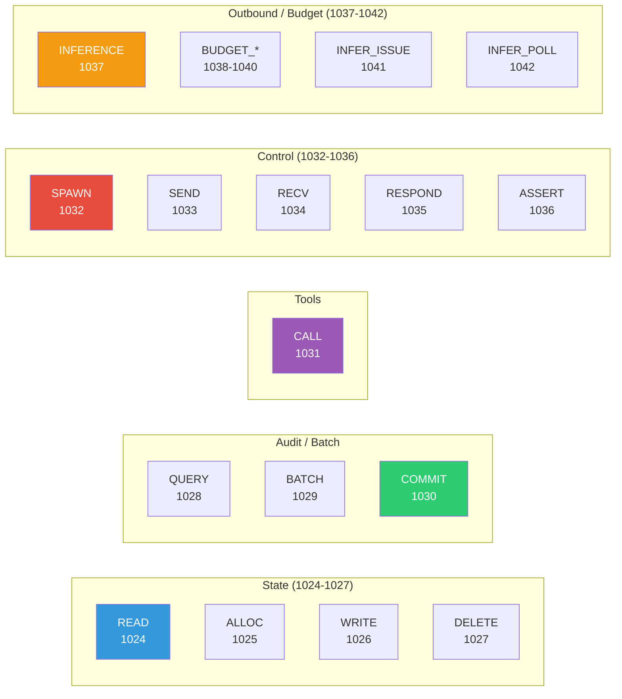
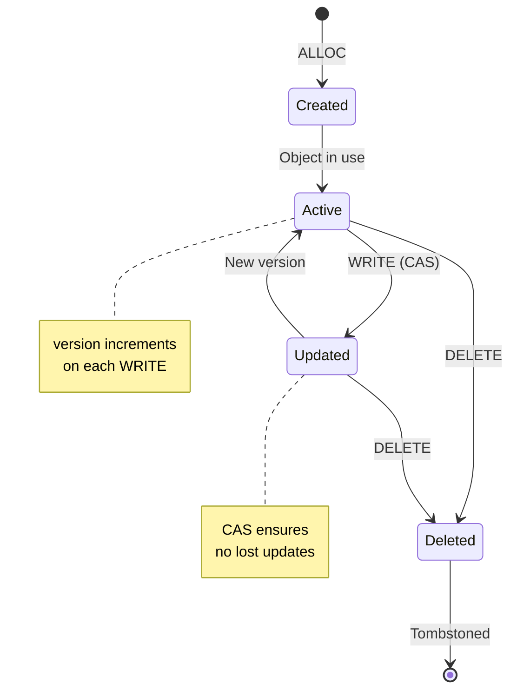
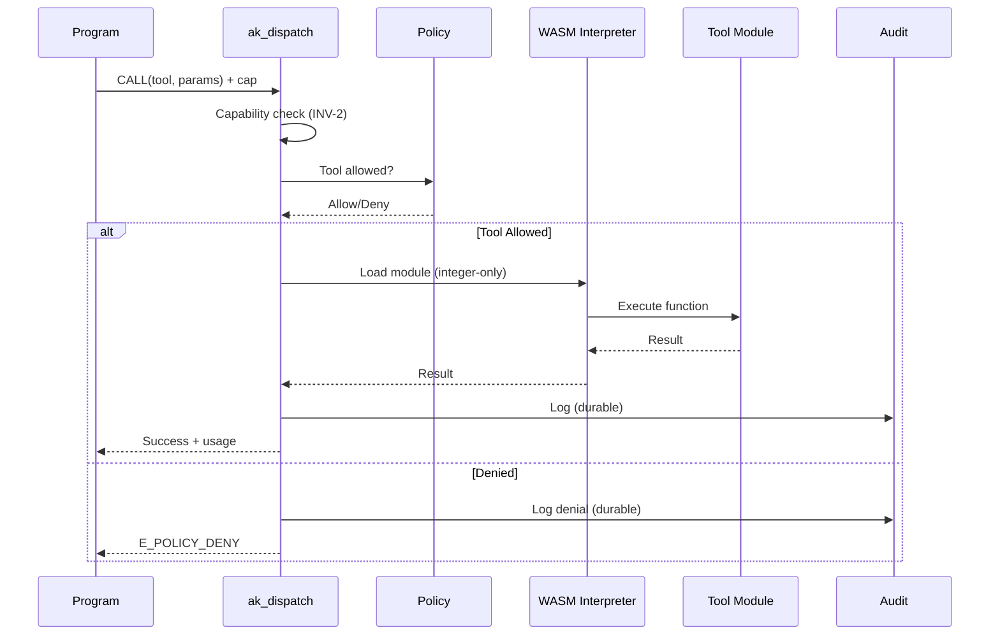
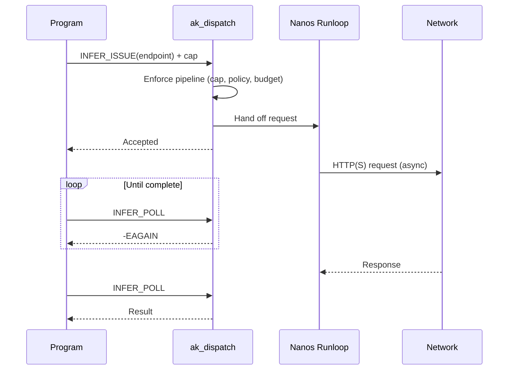

# Syscalls Reference

Detailed documentation for Authority Kernel syscalls. Every call is routed through `ak_syscall_handler()` into the `ak_dispatch()` pipeline before any effect executes.

## Syscall Categories Overview



## State Management



### AK_SYS_READ (1024)

Read a heap object by pointer.

**Request:**
```json
{
  "op": "READ",
  "args": {
    "ptr": 12345
  }
}
```

**Response:**
```json
{
  "ok": true,
  "result": {
    "ptr": 12345,
    "version": 5,
    "value": { ... },
    "taint": 0
  }
}
```

**Errors:**
- `ENOENT` — Object not found
- `E_CAP_SCOPE` — Capability doesn't cover this object

### AK_SYS_ALLOC (1025)

Allocate a new typed heap object.

**Request:**
```json
{
  "op": "ALLOC",
  "args": {
    "type": "State",
    "value": {
      "name": "worker",
      "status": "running"
    }
  }
}
```

**Response:**
```json
{
  "ok": true,
  "result": {
    "ptr": 12346,
    "version": 1
  }
}
```

**Errors:**
- `E_SCHEMA_INVALID` — Value doesn't match type schema
- `E_BUDGET_EXCEEDED` — Heap object limit reached

### AK_SYS_WRITE (1026)

Update an existing object with CAS semantics.

**Request:**
```json
{
  "op": "WRITE",
  "args": {
    "ptr": 12345,
    "expected_version": 5,
    "patch": [
      { "op": "replace", "path": "/status", "value": "completed" }
    ]
  }
}
```

**Response:**
```json
{
  "ok": true,
  "result": {
    "version": 6
  }
}
```

**Errors:**
- `E_CONFLICT` — Version mismatch (retry required)
- `E_SCHEMA_INVALID` — Patched value invalid
- `ENOENT` — Object not found

### AK_SYS_DELETE (1027)

Soft-delete an object (sets tombstone flag).

**Request:**
```json
{
  "op": "DELETE",
  "args": {
    "ptr": 12345,
    "expected_version": 6
  }
}
```

**Response:**
```json
{
  "ok": true,
  "result": {
    "deleted": true
  }
}
```

## Audit and Query

### AK_SYS_QUERY (1028)

Query the audit log.

**Request:**
```json
{
  "op": "QUERY",
  "args": {
    "start_seq": 0,
    "end_seq": 100
  }
}
```

**Response:**
```json
{
  "ok": true,
  "result": {
    "entries": [
      {
        "seq": 1,
        "op": "ALLOC",
        "req_hash": "...",
        "res_hash": "...",
        "this_hash": "..."
      }
    ],
    "head_seq": 1,
    "count": 1
  }
}
```

### AK_SYS_COMMIT (1030)

Force an immediate audit log commit (fsync). Note: the dispatcher already makes each entry durable before returning; `COMMIT` is an explicit flush point.

**Request:**
```json
{
  "op": "COMMIT"
}
```

**Response:**
```json
{
  "ok": true,
  "result": {
    "seq": 1234,
    "hash": "abc123..."
  }
}
```

## Batch

### AK_SYS_BATCH (1029)

Execute multiple operations atomically.

**Request:**
```json
{
  "op": "BATCH",
  "args": {
    "operations": [
      { "op": "WRITE", "ptr": 100, "version": 5, "patch": [...] },
      { "op": "WRITE", "ptr": 101, "version": 3, "patch": [...] }
    ]
  }
}
```

**Response:**
```json
{
  "ok": true,
  "result": {
    "results": [
      { "version": 6 },
      { "version": 4 }
    ]
  }
}
```

**Errors:**
- `E_CONFLICT` — Any operation version mismatch (all rolled back)

## Tools

Tools run in an **integer-only WASM subset interpreter** (`ak_wasm_interp.c`). The kernel is built `-mno-sse`, so float value types and opcodes are rejected fail-closed. Tool execution is gated by the same dispatch pipeline as every other syscall.



### AK_SYS_CALL (1031)

Execute a tool in the integer-only WASM interpreter.

**Request:**
```json
{
  "op": "CALL",
  "args": {
    "tool": "parse_record",
    "params": {
      "input": "..."
    }
  }
}
```

**Response:**
```json
{
  "ok": true,
  "result": {
    "output": { ... }
  },
  "usage": {
    "cpu_ns": 1500000
  }
}
```

**Errors:**
- `E_POLICY_DENY` — Tool not allowed by policy
- `E_CAP_SCOPE` — Capability doesn't cover this tool
- `E_TOOL_FAIL` — Tool execution failed
- `E_WASM_UNSUPPORTED` — Module uses float or unsupported opcodes (rejected fail-closed)
- `E_BUDGET_EXCEEDED` — Tool call budget exhausted

## Control

### AK_SYS_SPAWN (1032)

Create a confined child workload. The child holds only the capabilities delegated to it (attenuation); it never receives the root capability.

### AK_SYS_SEND (1033) / AK_SYS_RECV (1034)

Send and receive typed IPC messages. `RECV` dequeues only from the caller's own inbox. Both require an `AK_CAP_IPC` capability.

### AK_SYS_RESPOND (1035)

Send a response to the outside (DLP applied to the payload).

### AK_SYS_ASSERT (1036)

Assert a predicate; halts the workload on failure.

## Outbound Requests

External network access is capability-gated. `AK_SYS_INFERENCE` is the synchronous-enforcement outbound request handler; for network I/O, the async issue/poll pair is used so the kernel never blocks a thread on the network.

### AK_SYS_INFERENCE (1037)

Submit a capability-gated outbound request. Requires an `AK_CAP_INFERENCE` (alias `AK_CAP_LLM`) capability whose resource pattern covers the destination.

**Request:**
```json
{
  "op": "INFERENCE",
  "args": {
    "endpoint": "https://api.example.com/v1/complete",
    "method": "POST",
    "body": { ... }
  }
}
```

**Response:**
```json
{
  "ok": true,
  "result": {
    "status": 200,
    "body": { ... }
  },
  "usage": {
    "bytes": 512,
    "latency_ms": 450
  }
}
```

**Errors:**
- `E_POLICY_DENY` — Destination not allowed
- `E_CAP_SCOPE` — Outbound-request capability missing or out of scope
- `E_BUDGET_EXCEEDED` — Budget exhausted

### AK_SYS_INFER_ISSUE (1041) / AK_SYS_INFER_POLL (1042)

Async outbound HTTP(S). The kernel enforces the full pipeline on **issue**, hands the request to the runloop, and the program **polls** for the result. One request may be in flight per context.



**Issue request:**
```json
{
  "op": "INFER_ISSUE",
  "args": {
    "endpoint": "https://api.example.com/v1/complete",
    "method": "POST",
    "body": { ... }
  }
}
```

**Poll request:**
```json
{
  "op": "INFER_POLL"
}
```

**Poll response (pending):** returns `-EAGAIN` until the runloop has driven the request to completion.

**Poll response (ready):**
```json
{
  "ok": true,
  "result": {
    "status": 200,
    "body": { ... }
  }
}
```

## Budget Introspection

Read-only views over the hard budget tracked by the kernel.

### AK_SYS_BUDGET_STATUS (1038)

Current budget status.

**Request:**
```json
{
  "op": "BUDGET_STATUS"
}
```

**Response:**
```json
{
  "ok": true,
  "result": {
    "limit": 1000000,
    "used": 42315,
    "in_flight": 0,
    "remaining": 957685
  }
}
```

### AK_SYS_BUDGET_HISTORY (1039)

Historical budget snapshots.

### AK_SYS_BUDGET_BREAKDOWN (1040)

Detailed per-category budget breakdown.
