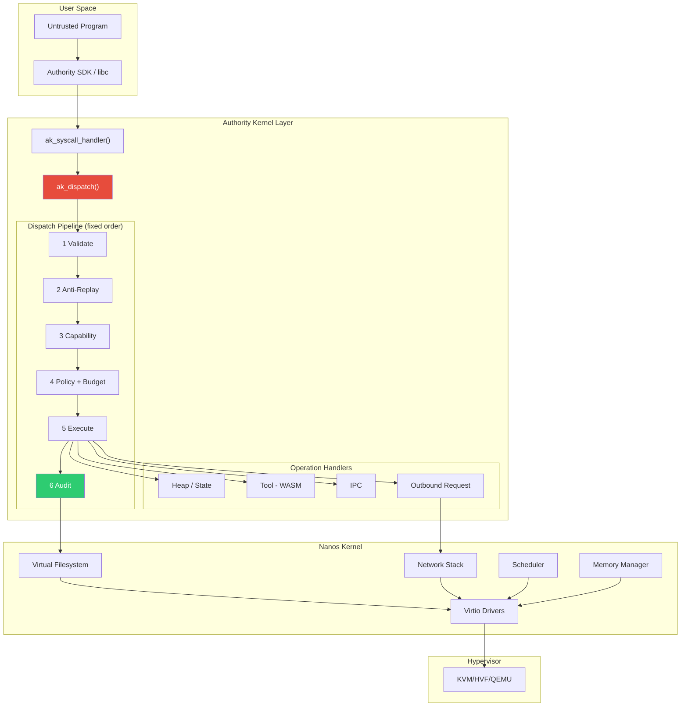
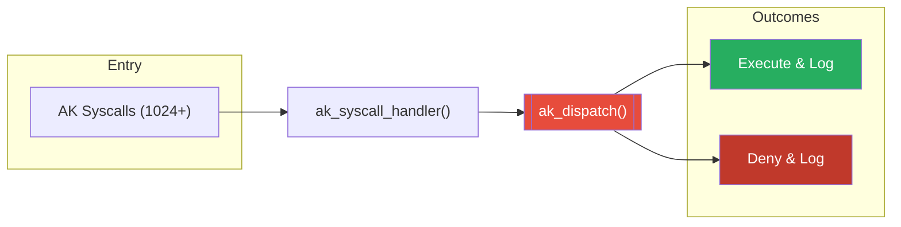
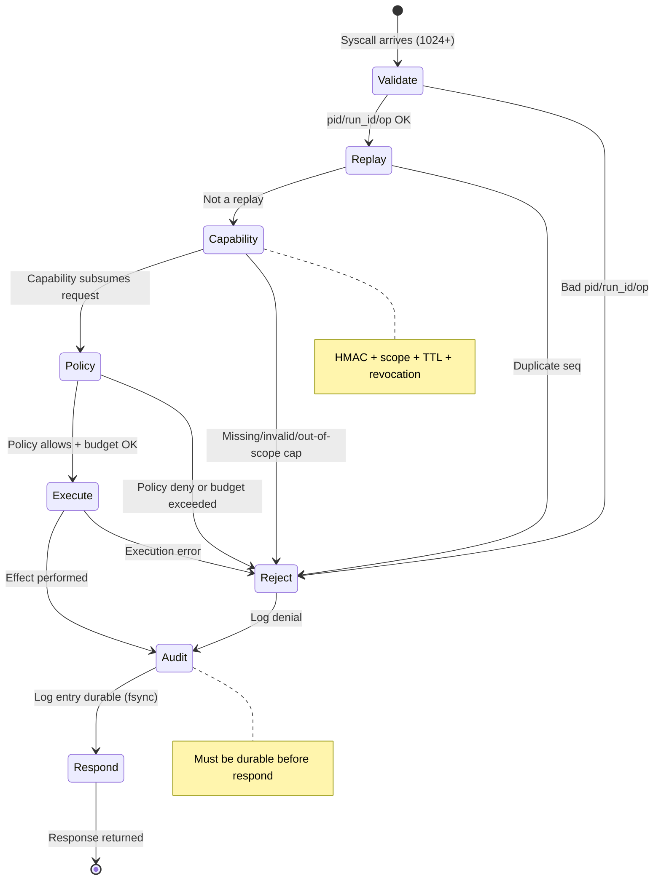
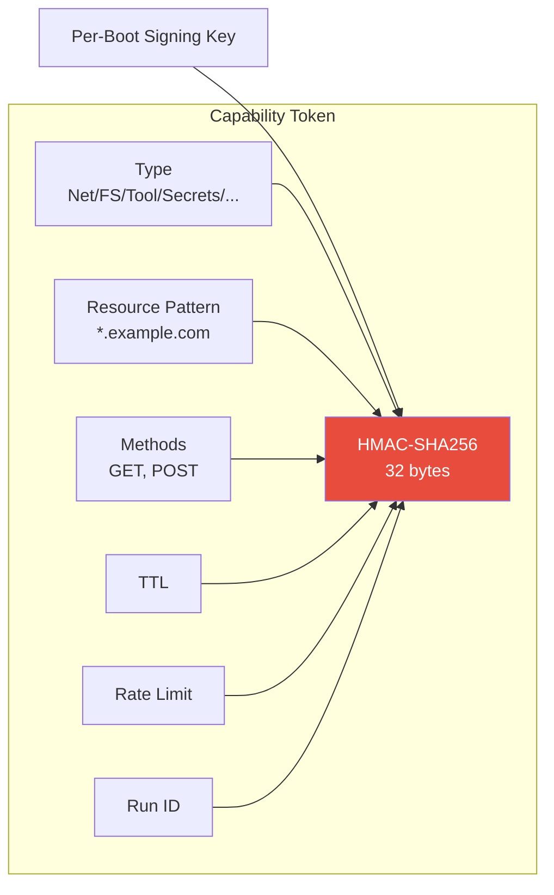
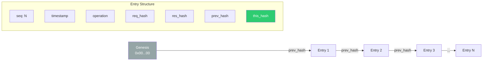
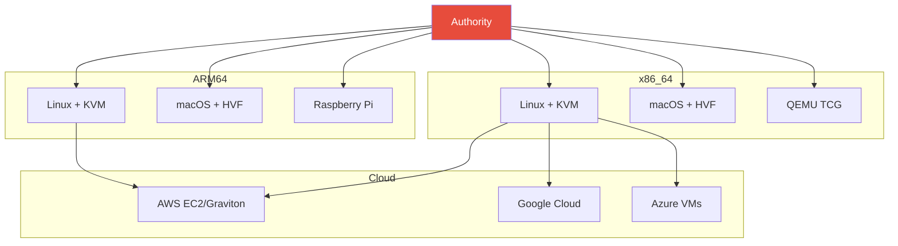

# Architecture Overview

Authority is a **capability-based security unikernel** — a fork of [Nanos](https://github.com/mbhatt1/nanos) that adds the **Authority Kernel**, a deny-by-default enforcement layer. Each VM runs a **single untrusted program** and the Authority Kernel enforces kernel-level security on every effect it attempts.

## System Stack

## Core Principle: One Dispatch Path

Every Authority syscall (numbers 1024+) is forwarded by the Nanos syscall layer to `ak_syscall_handler()`, which routes it through `ak_dispatch()`. The `ak_handle_*` operation handlers are never invoked directly — the dispatcher's pipeline runs first, every time.

- Default is **deny-by-default**: if the pipeline cannot prove an allow, the effect is denied.
- Tool execution, IPC, and outbound requests are ordinary handlers gated by the same pipeline.
- A legacy `ak_effects.c` layer exists in the tree but is **not compiled** into the kernel; the compiled path is the dispatch pipeline described here.

## Request Processing Pipeline

`ak_dispatch()` runs six stages in a fixed order; any failure short-circuits to audit and returns an error before the effect executes.

## Key Components

### Component Relationships

```mermaid
graph TB
    subgraph "Policy System"
        POLICY_FILE[Policy File<br/>JSON/TOML]
        POLICY_LOADER[Policy Loader]
        POLICY_EVAL[ak_policy_evaluate]
        PATTERN[Pattern Matcher]
    end

    subgraph "Capability System"
        CAP_TOKEN[Capability Token]
        HMAC[HMAC-SHA256]
        KEYRING[Per-Boot Signing Key]
        REVOKE[Revocation Set]
    end

    subgraph "Audit System"
        LOG_ENTRY[Log Entry]
        HASH_CHAIN[Hash Chain]
        SEGMENT[Segment Log]
        FSYNC[Durable fsync]
    end

    subgraph "Budget System"
        BUDGET_DEF[Budget Definition]
        USAGE[Usage Tracker]
        ADMIT[Admission Control]
    end

    POLICY_FILE --> POLICY_LOADER
    POLICY_LOADER --> POLICY_EVAL
    POLICY_EVAL --> PATTERN

    CAP_TOKEN --> HMAC
    HMAC --> KEYRING
    CAP_TOKEN --> REVOKE

    LOG_ENTRY --> HASH_CHAIN
    HASH_CHAIN --> SEGMENT
    SEGMENT --> FSYNC

    BUDGET_DEF --> ADMIT
    USAGE --> ADMIT

    style HMAC fill:#e74c3c,color:#fff
    style HASH_CHAIN fill:#2ecc71,color:#fff
    style ADMIT fill:#9b59b6,color:#fff
```

### Capability Token Structure

Capabilities are HMAC-signed tokens. The signing key is generated per boot from the Nanos CSPRNG and never leaves the kernel.

### Audit Log Hash Chain

Every dispatched request — allowed or denied — appends an entry, and the response is not returned until the entry is durable.

## Tool Execution and External I/O

- **Tools** invoked via `AK_SYS_CALL` run in an **integer-only WASM subset interpreter** (`ak_wasm_interp.c`). The kernel is built `-mno-sse` with no floating point, so float value types and opcodes are rejected fail-closed. This is a bounded integer-only interpreter, not a full WASM runtime.
- **Outbound network requests** use an async **issue/poll** model (`AK_SYS_INFER_ISSUE` / `AK_SYS_INFER_POLL`): the kernel enforces the pipeline on issue, the Nanos runloop drives the HTTP(S) request, and the program polls for the result. The kernel does not block a thread on external I/O.

## Platform Support

