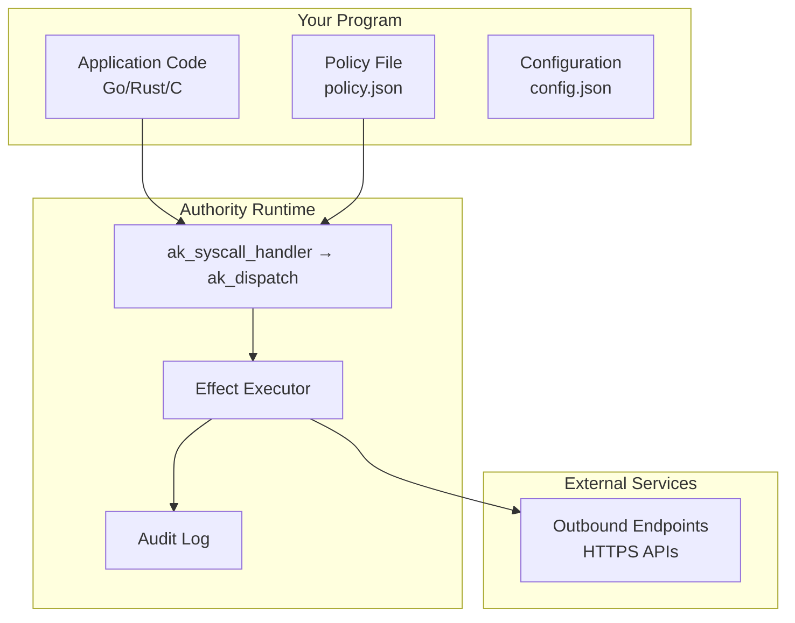
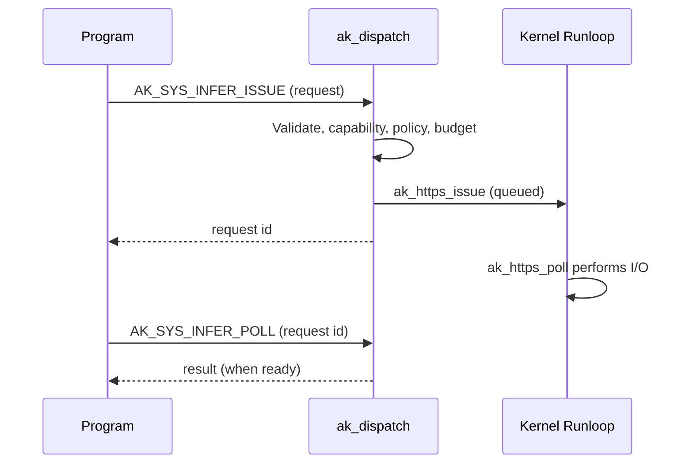
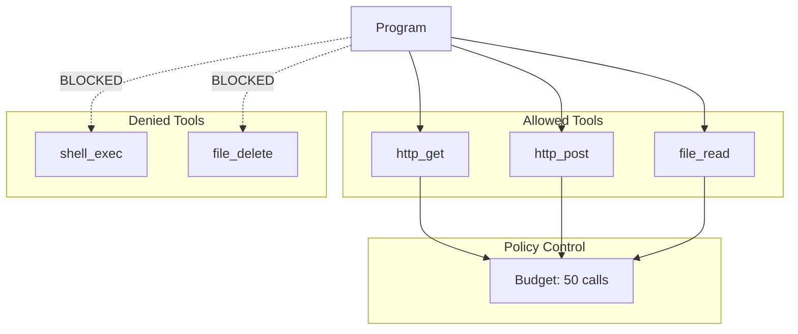

# Building Your First Program

This guide walks you through building a simple program and running it as a single untrusted workload on Authority, under a deny-by-default policy.

## Program Architecture



## Overview

A program on Authority consists of:

1. **Application code** — your workload logic (Go, Rust, C, etc.)
2. **Policy file** — declares what the program is allowed to do
3. **Configuration** — runtime settings and initrd layout

Every effect the program performs enters through `ak_syscall_handler`, which calls `ak_dispatch()`. Requests are validated, checked for replay, authorized against an HMAC-SHA256 capability, checked against policy and budget, executed, and appended to the hash-chained audit log — in that order.

## Step 1: Create the Program

Here's a simple program in Go that makes an outbound API call:

```go
// program.go
package main

import (
    "fmt"
    "io"
    "net/http"
)

func main() {
    // Make an allowed outbound request
    resp, err := http.Get("https://api.github.com/users/nanovms")
    if err != nil {
        fmt.Printf("Error: %v\n", err)
        return
    }
    defer resp.Body.Close()

    body, _ := io.ReadAll(resp.Body)
    fmt.Printf("Response: %s\n", body)
}
```

Build it:

```bash
GOOS=linux GOARCH=amd64 go build -o program program.go
```

## Step 2: Create the Policy

Create `policy.json`:

```json
{
  "version": "1.0",
  "fs": {
    "read": ["/app/**", "/etc/ssl/**", "/etc/resolv.conf"]
  },
  "net": {
    "dns": ["api.github.com"],
    "connect": ["dns:api.github.com:443"]
  },
  "profiles": ["tier1-musl"]
}
```

This policy:
- Allows reading application files and SSL certificates
- Allows DNS resolution for `api.github.com`
- Allows HTTPS connections to `api.github.com`
- Denies everything else

## Step 3: Create the Configuration

Create `config.json`:

```json
{
  "Files": ["policy.json"],
  "Dirs": ["ak"],
  "Args": [],
  "Env": {},
  "MapDirs": {
    "ak": "ak"
  }
}
```

Set up the directory structure:

```bash
mkdir -p ak
cp policy.json ak/policy.json
```

## Step 4: Run the Program

```bash
authority run -c config.json program
```

You should see the GitHub API response. If the program tries to reach a different host, it is denied before the connection is made:

```
AK DENY NET_CONNECT dns:evil.com:443 missing net.connect. Fix: connect = ["dns:evil.com:443"]
```

## Adding Outbound Requests

Beyond ordinary network syscalls, Authority provides a dedicated **outbound-request handler** for gated external calls. It uses an asynchronous issue/poll model so the kernel never blocks in-kernel on external I/O:



- Enforcement (validation, capability, policy, budget) happens **synchronously on issue**.
- The actual network I/O runs on the kernel runloop.
- The program polls for the result with `AK_SYS_INFER_POLL`.

Because outbound requests reach external hosts, they still require the corresponding `net.dns` and `net.connect` policy rules, and they consume the `tokens` budget when the response reports token counts:

```json
{
  "version": "1.0",
  "net": {
    "dns": ["api.example.com"],
    "connect": ["dns:api.example.com:443"]
  },
  "budgets": {
    "tokens": 100000
  }
}
```

## Adding Tool Support

Tools run in an **integer-only WASM sandbox**. The kernel is built `-mno-sse`, so tools that use floating-point are rejected. Each tool call is gated by policy and counted against the tool-call budget.



To allow your program to use tools:

```json
{
  "version": "1.0",
  "tools": {
    "allow": [
      "http_get",
      "http_post",
      "file_read"
    ],
    "deny": [
      "shell_exec",
      "file_delete"
    ]
  },
  "budgets": {
    "tool_calls": 50
  }
}
```

## Complete Example

A complete policy for a program that makes outbound requests, calls sandboxed tools, and runs under hard budgets:

```json
{
  "version": "1.0",
  "fs": {
    "read": ["/app/**", "/etc/ssl/**"],
    "write": ["/app/workspace/**", "/tmp/**"]
  },
  "net": {
    "dns": ["api.example.com", "api.github.com"],
    "connect": [
      "dns:api.example.com:443",
      "dns:api.github.com:443"
    ]
  },
  "tools": {
    "allow": ["http_get", "file_read", "file_write"],
    "deny": ["shell_exec"]
  },
  "budgets": {
    "tool_calls": 100,
    "tokens": 100000,
    "wall_time_ms": 300000
  },
  "profiles": ["tier1-musl"]
}
```

## Next Steps

- [Policy Reference](/policy/) - All policy options
- [Security Invariants](/security/invariants) - Understanding the guarantees
- [API Reference](/api/) - Authority kernel syscalls
