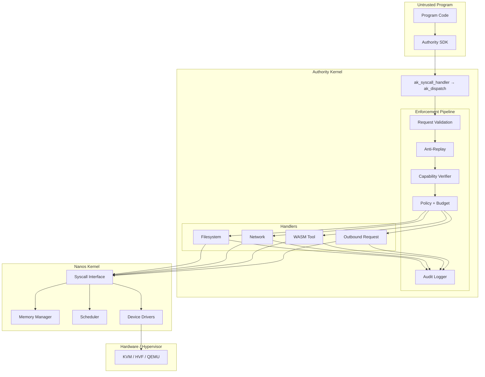
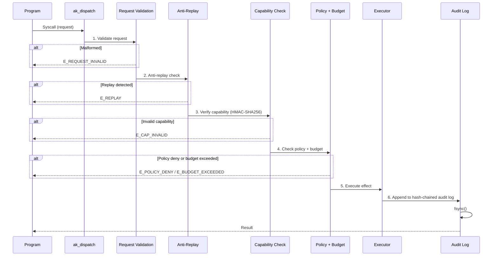
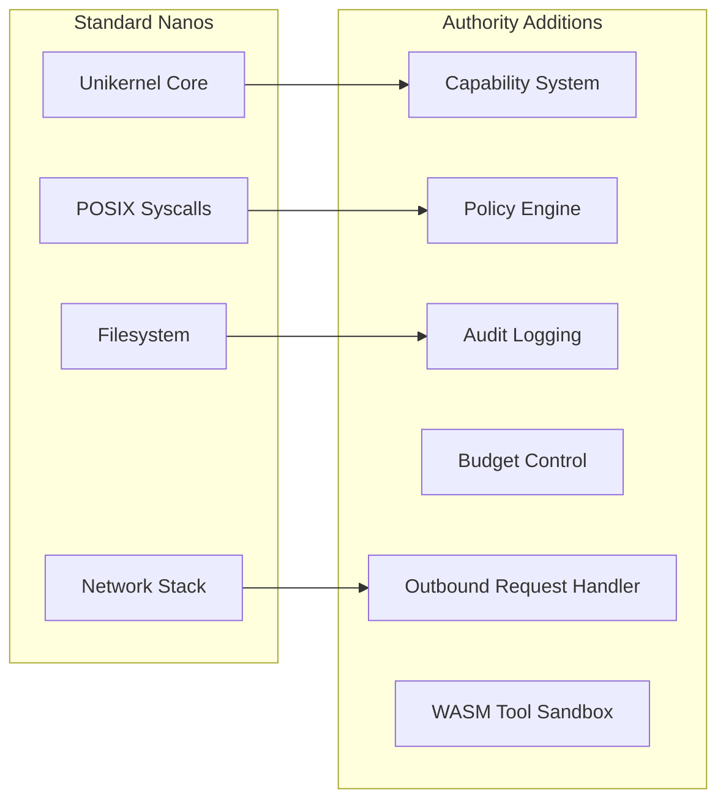
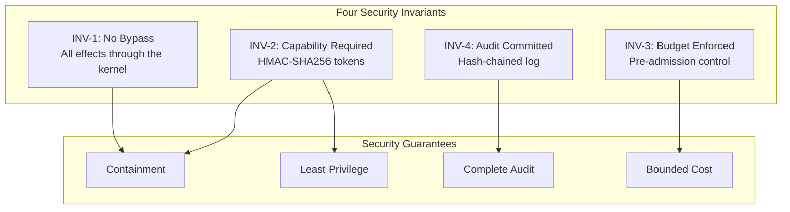
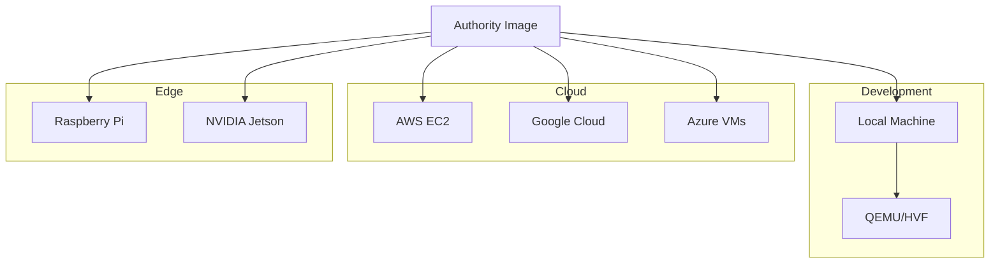

## System Architecture



## Request Flow

Every effectful syscall enters through `ak_syscall_handler`, which calls `ak_dispatch()`. `ak_dispatch()` runs a fixed six-stage pipeline before any effect is executed:



## What is Authority?

Authority is a **fork of [Nanos](https://github.com/mbhatt1/nanos)** that adds the **Authority kernel** — a capability-based security layer that runs a single untrusted program per VM and mediates every effect that program performs. It is not a general-purpose OS: one VM runs one program, and the kernel enforces cryptographic authorization, deny-by-default policy, hard budgets, and a tamper-evident audit trail on everything that program does.



## Security Model



## Quick Example

Create a policy file (`/ak/policy.json`):

```json
{
  "version": "1.0",
  "fs": {
    "read": ["/app/**", "/lib/**"],
    "write": ["/tmp/**"]
  },
  "net": {
    "dns": ["api.example.com"],
    "connect": ["dns:api.example.com:443"]
  },
  "profiles": ["tier1-musl"]
}
```

Build and run:

```bash
authority build myapp -c config.json
authority run myapp
```

## Deployment Options



## Project Status

| Component | Status |
|-----------|--------|
| Core Kernel | Stable |
| Authority Kernel | Stable |
| Security Invariants (INV-1 to INV-4) | Enforced |
| Documentation | Active |

See the [roadmap](/guide/roadmap) for upcoming features.
