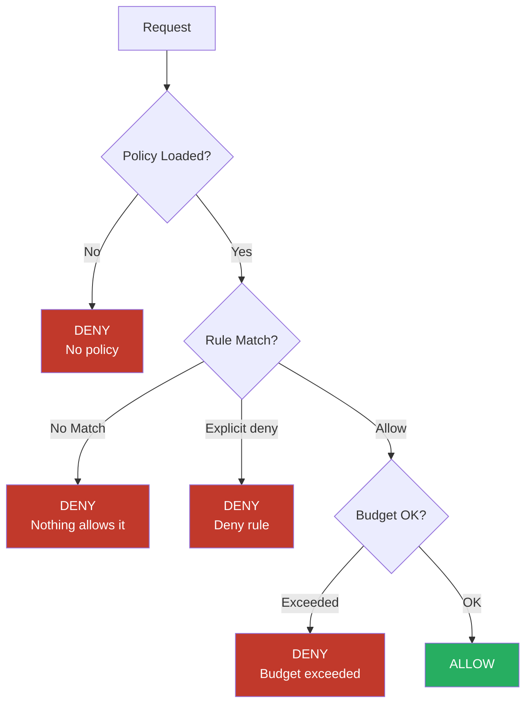
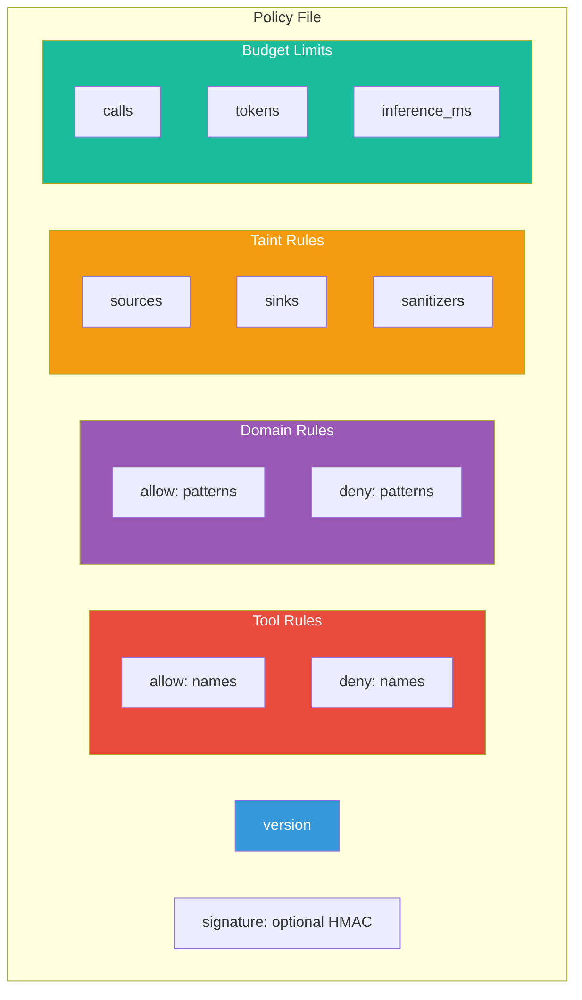
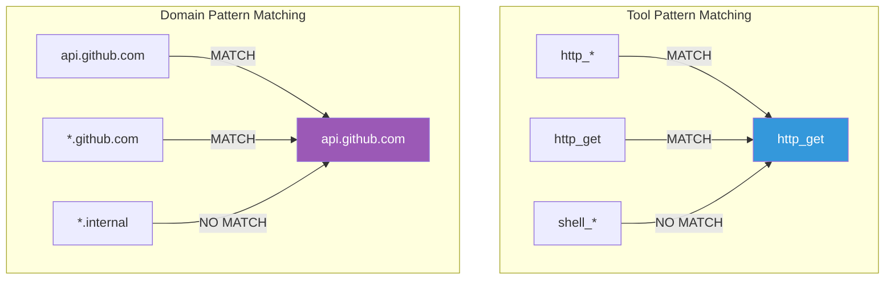
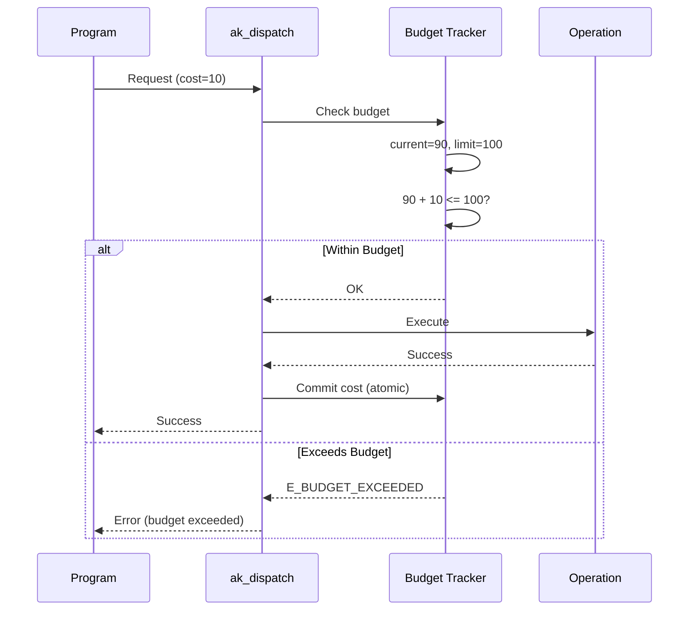
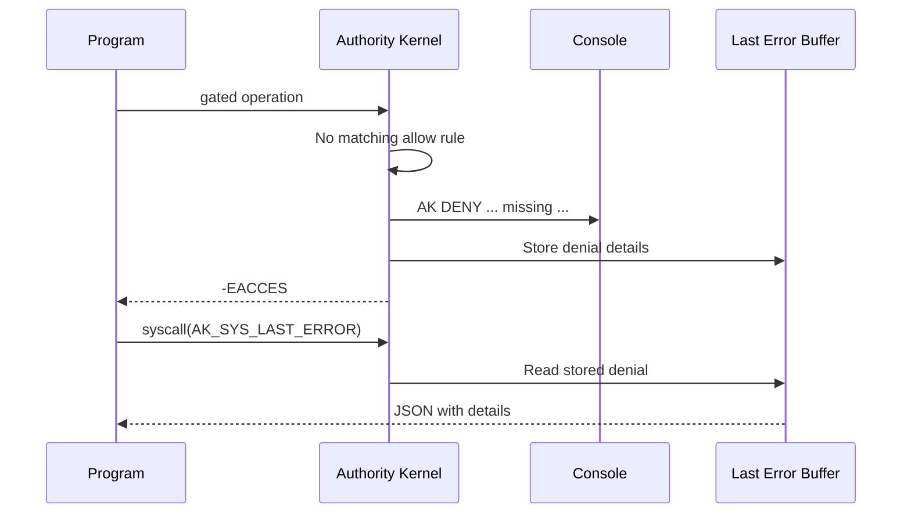

# Policy Overview

The Authority kernel uses a **deny-by-default** policy model:

- If no policy is loaded, ALL gated operations are denied
- If a policy is loaded, only explicitly allowed operations succeed
- An unmatched tool or domain = deny

The compiled policy engine is `src/agentic/ak_policy.c`, which parses **JSON**. This page describes the schema that engine actually parses.

## Policy Evaluation Flow



## Policy Structure (compiled schema)



## Policy Format

- [JSON Format](/policy/json-format) - The format parsed by the compiled engine
- [TOML Format](/policy/toml-format) - A planned human-friendly alternative (not yet in the kernel build)

## Policy Location

```mermaid
graph LR
    subgraph "Development"
        INITRD[/ak/policy.json<br/>in initrd]
    end

    subgraph "Production"
        EMBED[Embedded in kernel<br/>at compile time]
    end

    subgraph "Runtime"
        LOADER[Policy Loader]
        CACHE[Cached Policy]
    end

    INITRD --> LOADER
    EMBED --> LOADER
    LOADER --> CACHE

    style INITRD fill:#3498db,color:#fff
    style EMBED fill:#e74c3c,color:#fff
    style CACHE fill:#2ecc71,color:#fff
```

### Development (Initrd)

Place your policy at `/ak/policy.json` in the initrd:

```bash
mkdir -p initrd/ak
cp policy.json initrd/ak/policy.json
```

### Production (Embedded)

Compile the policy into the kernel image:

```makefile
CFLAGS += -DCONFIG_AK_EMBEDDED_POLICY=1
```

## Pattern Matching

Tool and domain rules use glob patterns. Deny rules take precedence over allow.



## Quick Reference

### Tool Rules

```json
{
  "tools": {
    "allow": ["http_get", "file_read"],
    "deny": ["shell_exec"]
  }
}
```

### Domain Rules

Domains gate outbound destinations.

```json
{
  "domains": {
    "allow": ["*.github.com", "api.example.com"],
    "deny": ["*.internal"]
  }
}
```

### Budgets

```json
{
  "budgets": {
    "calls": 100,
    "tokens": 100000,
    "inference_ms": 60000,
    "file_bytes": 10485760
  }
}
```

## Budget Enforcement



## Denial Debugging



### Last Error Syscall

```c
char buf[1024];
syscall(AK_SYS_LAST_ERROR, buf, sizeof(buf));
// buf contains JSON with denial details
```

## Validation

The parser validates:
- `version` field present
- All patterns are valid strings within bounds
- Numeric budget values parse without overflow
- Trailing garbage after the top-level object is rejected (fail-closed)
- Unknown members are skipped

### Not Yet in the Compiled Engine

Path-level filesystem rules (`fs.read`/`fs.write`), structured network rules (`net.connect`/`net.dns`/`bind`/`listen`), `wasm`, `infer`, and `profiles` sections are **not** parsed by `ak_policy.c`. They belong to the effect layer that is not in the current kernel build. Do not rely on them.
