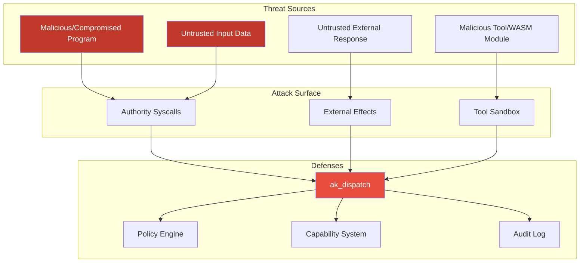
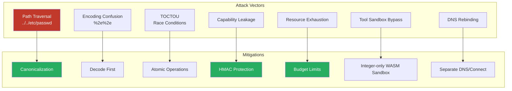
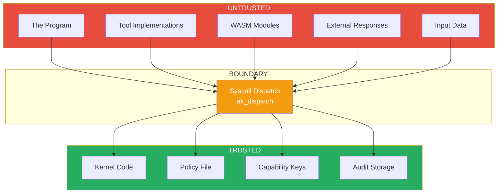

# Threat Model

This document defines the threat model for the Authority kernel's deny-by-default security system. Authority runs a **single untrusted program** per VM; the threat model is about sandboxing that program so it cannot cause external effects outside its granted authority.

## Threat Model Overview

## Attacker Model

### Threat Sources

**Primary: The Untrusted Program**
- Program code that attempts to exceed its authorized capabilities
- A program that has been compromised at runtime by crafted input
- Tools or WASM modules loaded by the program with malicious intent

**Secondary: Untrusted External Input**
- Data returned from external requests
- Input designed to trigger unintended behavior
- Responses containing malicious payloads

### Attacker Capabilities

We assume the attacker can:
- Execute arbitrary code as the program inside the VM
- Make arbitrary syscalls (which are mediated by the Authority kernel)
- Craft malicious tool inputs/outputs
- Attempt to confuse policy matching through encoding tricks
- Attempt time-of-check to time-of-use (TOCTOU) attacks

### Attacker Limitations

We assume the attacker CANNOT:
- Execute code in kernel space
- Modify kernel memory directly
- Bypass CPU protection mechanisms (rings, MMU)
- Access hardware directly (all I/O is virtualized)
- Modify the policy after it is loaded

## Security Goals

### Non-Bypass (INV-1)

**Goal:** No effectful operation can bypass Authority kernel mediation.

**Mechanism:**
- The program is the single workload in the VM; there is no other process or device path
- Every Authority syscall (1024+) routes through `ak_dispatch()`
- Tool and WASM operations that touch external state are capability-gated

**Verification:**
- Static analysis: No effectful paths that skip mediation
- Runtime: raw/unknown syscalls are rejected

### Deny-by-Default (INV-DENY)

**Goal:** Any operation not explicitly allowed by policy is denied.

**Mechanism:**
- Policy matching returns DENY if no rule matches
- Missing policy = fail closed
- Empty policy sections = deny that category

### Capability Integrity (INV-2)

**Goal:** Capabilities cannot be forged or escalated.

**Mechanism:**
- Capabilities are HMAC-SHA256 protected
- The kernel controls capability issuance
- Delegation can only attenuate, never escalate
- Revocation is immediate and audited

### Budget Enforcement (INV-3)

**Goal:** Resource consumption is bounded and tracked.

**Mechanism:**
- Per-run budget limits (tokens, calls, time, bytes, heap, spawns)
- Pre-admission budget check with overflow-safe, atomic accounting
- Exceeded budget = operation denied

### Audit Integrity (INV-4)

**Goal:** All committed operations are logged and logs are tamper-evident.

**Mechanism:**
- Hash-chained audit entries
- Audit append before response is returned
- Bounded ring buffer for high-volume events

## Attack Vectors and Mitigations

### Path Traversal

**Attack:** Use `..` or symbolic links to reach targets outside allowed patterns.

**Mitigation:**
- Canonicalization before policy matching
- Normalize `.` and `..` segments
- Lexical canonicalization (symlinks not resolved)

### Encoding Confusion

**Attack:** Use different encodings to confuse policy matching (e.g. `%2e%2e` for `..`).

**Mitigation:**
- Decode before canonicalization
- Single canonical form for all targets
- Bounded buffers prevent overflow

### TOCTOU (Time-of-Check to Time-of-Use)

**Attack:** Change the target between the policy check and the operation.

**Mitigation:**
- Canonicalize immediately on syscall entry
- Use the canonical target for both check and operation

### Capability Leakage

**Attack:** Extract or forge capability tokens.

**Mitigation:**
- Capabilities are HMAC-protected
- Keys are kernel-internal only
- Capabilities are bound to `run_id`
- Rate limiting resists brute force

### Resource Exhaustion

**Attack:** Exhaust system resources to cause denial of service.

**Mitigation:**
- Budget limits on all resource types
- Bounded buffers throughout
- Rate limiting on deny logging
- Ring buffer for high-volume audit events

### Tool Sandbox Bypass

**Attack:** Use a tool or WASM module to perform an operation that bypasses the kernel.

**Mitigation:**
- Tools cannot touch external state directly; their effects route through the kernel
- The WASM interpreter is integer-only and fail-closed: modules that declare or use floating point are rejected
- No ambient authority in the tool sandbox

### DNS Rebinding

**Attack:** A resolution result changes between resolve and connect.

**Mitigation:**
- Separate DNS-resolution and connect authorization
- Resolution is itself an effect requiring authorization
- Policy can require destination-based connect authorization

### Audit Log Overflow

**Attack:** Generate many events to overflow the audit log.

**Mitigation:**
- Bounded ring buffer for high-volume events
- Rate limiting on deny messages
- Control-plane events counted toward budget

## Trust Boundaries

### Trusted Components

- Kernel code (including the Authority kernel subsystem)
- Policy file (validated at load time)
- Capability keys (kernel-internal)
- Audit log storage

### Untrusted Components

- The program's code
- Tool implementations
- WASM modules
- External responses
- Input data

### Boundary Enforcement

Every crossing from untrusted to trusted requires:
1. A request with a canonical target
2. Authorization via `ak_dispatch()` (capability + policy + budget)
3. Audit logging
4. Bounded, validated parameters

## Assumptions

### Hardware/Hypervisor

- CPU protection mechanisms work correctly
- MMU enforces memory protection
- Hypervisor is trusted

### Kernel

- Kernel code is not compromised
- Kernel memory is protected from the program

### Policy

- Policy is created by a trusted administrator
- Policy is not modified after load
- Policy signature (if present) is verified

### Cryptography

- SHA-256 is collision-resistant
- HMAC-SHA256 is unforgeable

## Out of Scope

The following are explicitly NOT protected against:

### Side Channels

- Timing attacks on policy matching
- Cache-based side channels
- Speculative execution attacks

### Physical Attacks

- Physical access to hardware
- Cold boot attacks
- Hardware implants

### Denial of Service

- Legitimate resource exhaustion within budget
- Network-level DoS (external to the kernel)

### Policy Errors

- Overly permissive policy configuration
- Missing rules that should be present
- Incorrect pattern specifications

### Kernel Vulnerabilities

- Bugs in kernel code itself
- Memory corruption in trusted code

## Security Invariant Summary

| ID | Invariant | Description |
|----|-----------|-------------|
| INV-1 | No-Bypass | All effects through mediation |
| INV-2 | Capability | Every effectful op needs a valid cap |
| INV-3 | Budget | Resource limits enforced |
| INV-4 | Log Commitment | All ops audited before response |
| INV-DENY | Deny-by-Default | No implicit permissions |
| INV-CANONICAL | Canonicalization | Targets normalized before match |
| INV-BOUNDED | Bounded Buffers | All buffers have max sizes |
